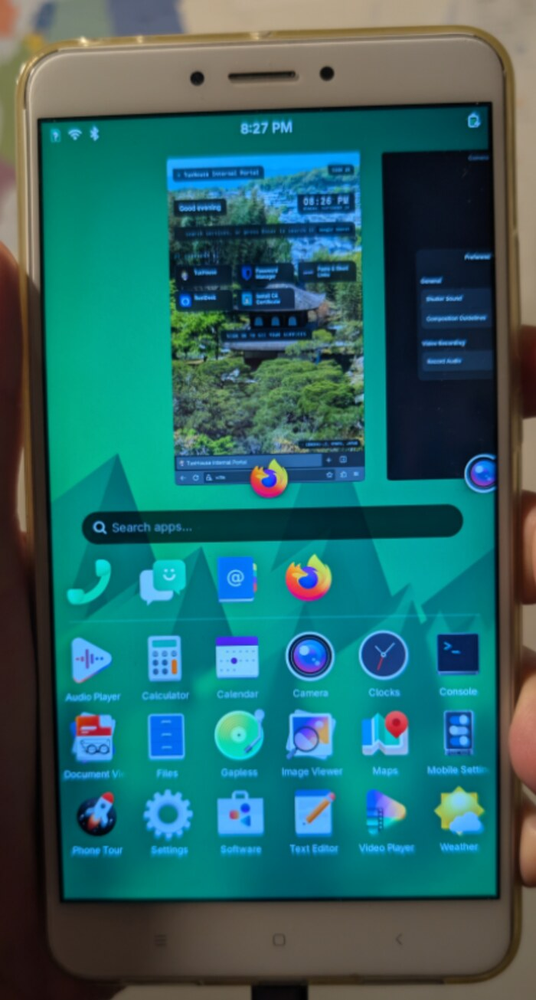
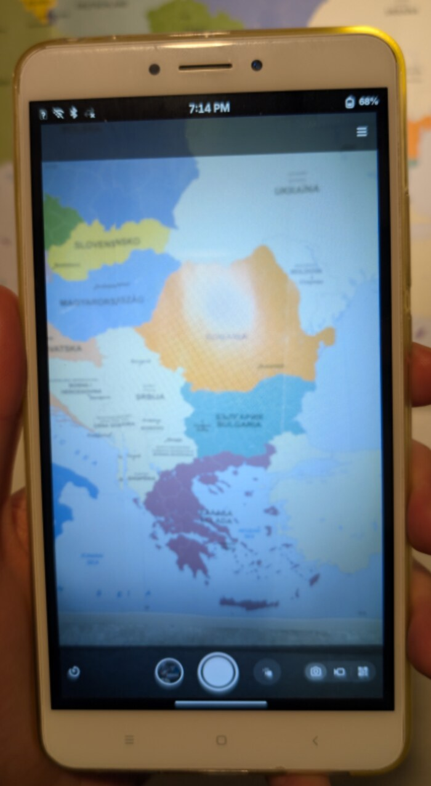
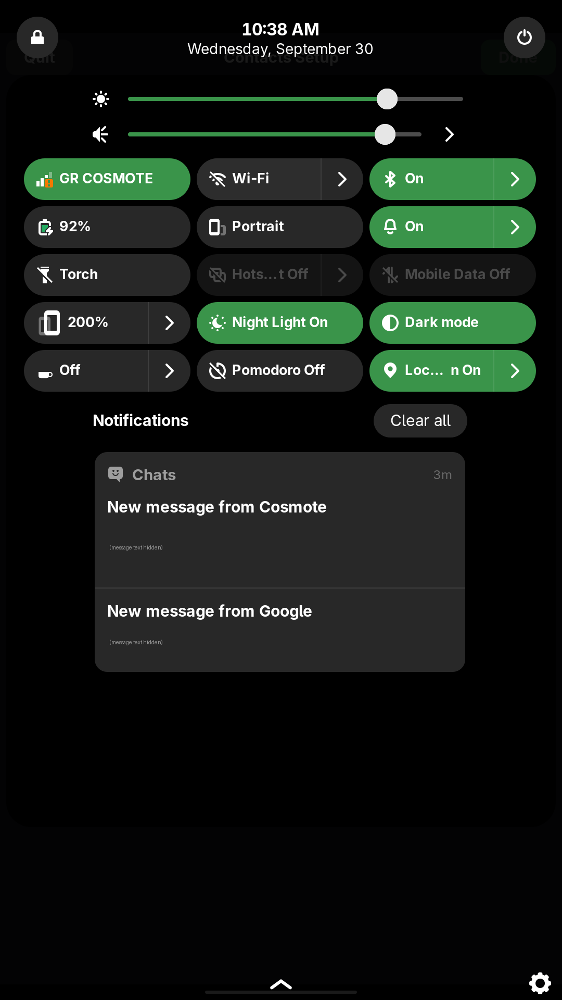
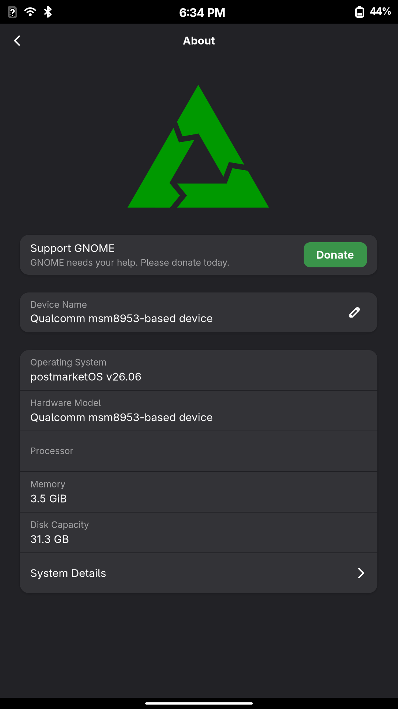

# Xiaomi Mi Max 2 (`oxygen`) on Nura (formerly postmarketOS)

This repository brings more of the **Xiaomi Mi Max 2** (codename `oxygen`,
Snapdragon 625 / MSM8953) to life on **Nura**, the Alpine-based mobile Linux distribution
previously known as postmarketOS, running the **mainline Linux kernel**. It adds
both cameras, the rear LED as a torch and working calls, SMS and mobile data, and
it documents the loudspeaker research so far. Everything is open: sources,
patches, prebuilt files, one install script, and write-ups of how each problem
was found and solved.

By **Dimitris Vagiakakos** ([@sv1sjp](https://github.com/sv1sjp), [tuxhouse.eu](https://tuxhouse.eu)).

The work was done with the help of an AI assistant (Claude, by Anthropic). See
[About AI assistance and contributing upstream](#about-ai-assistance-and-contributing-upstream)
for what that means for reuse.

## Why this project exists

The Mi Max 2 is a big-screen phone from 2017 that still works well, and Nura
already boots it with the mainline kernel (listed as a "testing" device on the
[Nura wiki](https://wiki.nura.eco/wiki/Xiaomi_Mi_Max_2_(xiaomi-oxygen))): display, touch, Wi-Fi, Bluetooth and battery work. But the
parts that make it a usable daily phone did not: no cameras, no camera flash, no
audio, and no calls, SMS or mobile data.

This project has two goals:

1. **Bring the Mi Max 2 into the native mobile Linux world** as a phone you can
   actually use, instead of electronic waste.
2. **Make the knowledge reusable.** Many phones share the MSM8953 platform and its
   parts (camera subsystem, PMI8950 flash, TAS25xx amplifiers, the modem stack).
   Every fix here comes with the reasoning, the hardware facts and the test
   results behind it, so others can apply them to more devices, or understand the
   concepts well enough to write their own implementation and contribute it upstream.

## Before and after

| Feature             | Nura wiki (before) | With this repository                                                                                                                                           |
| ------------------- | ------------------ | -------------------------------------------------------------------------------------------------------------------------------------------------------------- |
| Rear camera         | ❌ not working      | ✅ Working - Sony IMX386, 12 MP, autofocus, full field of view at 1080p (preview lags a little, because image processing runs in software)                      |
| Front camera        | ❌ not working      | ✅ Working - Samsung S5K5E8, 5 MP, new driver (preview lags a little, because image processing runs in software)                                                |
| Camera flash        | ❌ not working      | ✅ the rear LED works as a torch (4 levels, cool/warm). No photo flash in the camera app (Snapshot) yet, but you can switch the torch on and then take pictures |
| Calls               | ❌ not working      | ✅ working                                                                                                                                                      |
| SMS                 | ❌ not working      | ✅ working                                                                                                                                                      |
| Mobile data         | ❌ not working      | ✅ working                                                                                                                                                      |
| Audio (loudspeaker) | ❌ not working      | ❌ still not working; all research is documented in [`audio/`](audio/README.md) for anyone who wants to continue                                    |

Details and limits of each part: [Detailed status](#detailed-status).

## Screenshots

<p>


</p>

Left: the Mi Max 2 running Nura. Right: the working rear camera in the camera app (Snapshot),
with the LED torch switched on.

<p>


</p>

Left: the SIM registered on the mobile network (carrier and signal in the first tile),
the **Torch** toggle, and two SMS that arrived (their texts are hidden here). Right:
the phone running Nura (still called postmarketOS v26.06 there) on the MSM8953.

## About AI assistance and contributing upstream

The drivers, patches, scripts and write-ups here were produced in collaboration with
an AI assistant and tested on a real Mi Max 2 (`oxygen`).

The Nura project **does not accept LLM-generated contributions**. One of its
maintainers explains the reasons [in this post](https://social.treehouse.systems/@cas/117347732017118902): the social and
environmental cost of these models, and the risk that people use them to produce
private knowledge instead of joining and strengthening the community whose work
the models learned from. We respect that decision. So:

- **This repository is not a contribution to Nura or pmaports**, and its code
  should not be submitted there as it is.
- It is **public documentation**, not private notes. The reusable part is the
  knowledge: how the hardware is wired, register addresses and meanings, root
  causes, what was tried and ruled out, and how to test safely. These are facts
  anyone can check on their own device. It can save time for anyone who wants to
  understand what works and what does not, and then write their own code to submit
  upstream.
- If you want to get this into Nura or upstream, **learn from it, verify it on
  your hardware and write your own implementation**, following the rules of the
  project you contribute to (Nura, the Linux kernel and libcamera each have their
  own contribution policies).
- **Please engage with the community.** The Nura wiki, the
  [msm8953-mainline](https://github.com/msm8953-mainline/linux) project and the
  people credited [below](#credits) did the groundwork this builds on.

## How to use this repository

- **Use your Mi Max 2 with Nura:** follow [Install](#install-prebuilt). One
  script installs everything, or pick parts with `--camera`, `--led`, `--sim`.
  On a newer Nura release, see [Newer Nura versions](#newer-nura-versions---newversion).
- **Understand how it works:** read the sections for each part:
  [SIM card and modem](#sim-card-and-modem), [Camera](#camera),
  [Front camera](#front-camera-s5k5e8), [Rear LED torch](#rear-led-torch),
  [Hardware notes](#hardware-notes-from-the-downstream-device-tree-and-the-vendor-camera-libraries),
  and [`audio/`](audio/README.md) for the loudspeaker.
- **Bring another device further:** most of this applies beyond the Mi Max 2:
  - the camera-subsystem clock fix and the binned sensor modes affect every MSM8953 phone;
  - the way the sensor drivers were built (register tables from the phone's own
    Android camera libraries, meanings from the sensor's standard registers and
    open-source drivers for the same sensor) works for any phone with an unsupported sensor;
  - the PMI8950 torch and the SIM wait fix apply to other phones with the same parts;
  - the audio research documents a whole debugging method (safe RAM-boot testing,
    pin sampling, register snapshots, DSP firmware analysis).
- **Find the sources:** every source tree this work was built on is listed in
  [References](#references-source-trees).

## Install (prebuilt)

**Before you start:** the phone must run **Nura (formerly postmarketOS) v26.06** or newer
with Phosh. The prebuilt files are made for exactly its kernel
`linux-postmarketos-qcom-msm8953` **7.0.9-r0** and libcamera **99990.7.1-r0**
(tested on one phone); for newer versions see
[Newer Nura versions](#newer-nura-versions---newversion). The SIM fix alone works
on any version. The generic MSM8953 image already has the GPU
driver, but on `oxygen` the GPU also needs its **zap shader**, a small firmware file
signed for this phone model, so it cannot ship in the generic image: copy
`a506_zap.mdt` + `.b00`–`.b02` from the Android vendor partition (`/vendor/firmware/`)
to `/usr/lib/firmware/qcom/msm8953/xiaomi/oxygen/`. Without it the GPU fails to
start (`gpu hw init failed`) and the login screen crash-loops, with or without this
repository.

1. Copy this folder to the phone, for example over USB networking:
   `scp -r mi-max2-oxygen-msm8953-nura-drivers user@172.16.42.1:`
2. On the phone:
   ```sh
   cd mi-max2-oxygen-msm8953-nura-drivers
   sudo sh install.sh            # everything: cameras + rear LED torch + SIM
   sudo reboot
   ```
   Or pick a part:
   ```sh
   sudo sh install.sh --camera   # both cameras only
   sudo sh install.sh --led      # rear LED torch only
   sudo sh install.sh --sim      # SIM fix only (no kernel files, works on any kernel version)
   sudo sh install.sh --check    # only check phone, kernel and files (add --camera/--led/--sim to check those)
   sudo sh install.sh --ignore   # install even though the kernel/libcamera package revision differs (see below)
   ```
   Parts can be added later (for example `--led` after `--camera`). The
   installer remembers what is installed and always writes the one DTB that
   contains all installed parts.
3. Open **Camera (Snapshot)**. The picture brightens within ~1 s, then the focus
   sweeps once (the preview goes blurry, then sharp).

`install.sh` checks that it runs on an `oxygen` with the kernel and libcamera
versions the files were made for (camera and LED only), verifies every file
against `SHA256SUMS`, and backs up every original file it replaces to
`/var/lib/mi-max-2-mainline/backup` (once; later runs never overwrite the
originals). It installs:

| Part | What | Where |
|---|---|---|
| camera | `imx386.ko`, `s5k5e8.ko`, `dw9768.ko` (DW9763), fixed `qcom-camss.ko` | `/lib/modules/7.0.9-msm8953/updates/` |
| camera | patched libcamera (`libcamera.so`, `libcamera-base.so`, simple IPA + signature, IPA proxy, `cam`), `imx386.yaml` and `s5k5e8.yaml` | `/usr/lib`, `/usr/libexec/libcamera`, `/usr/bin`, `/usr/share/libcamera/ipa/simple/` |
| LED | `leds-qcom-pmi8950-torch.ko` | `/lib/modules/7.0.9-msm8953/updates/` |
| LED | udev rule (no notification blinking on the flash) | `/etc/udev/rules.d/73-oxygen-flash-not-notification.rules` |
| camera, LED | DTB: `camera`, `led` or `camera-led` variant | `/boot/msm8953-xiaomi-oxygen.dtb` and `/boot/dtbs/qcom/msm8953-xiaomi-oxygen.dtb` |
| SIM | `modem/sim-wait.conf` (systemd drop-in, `SIM_WAIT_TIME=30`) | `/etc/systemd/system/msm-modem-uim-selection.service.d/sim-wait.conf` |

**Undo:** `sudo sh revert.sh` (everything), `sudo sh revert.sh --camera`,
`--led` or `--sim`, then reboot. Removing one part keeps the others (and switches
to the DTB for what is left); removing everything restores the original DTB and
libcamera.

**System upgrades:** an upgrade of the kernel or of `libcamera` replaces these
files with the stock ones, so the camera or torch stops working until you install
again: `install.sh` if the versions did not change, otherwise
[`install.sh --newversion`](#newer-nura-versions---newversion), which builds them on the phone.
Both scripts notice an upgrade: they drop the outdated backups instead of
restoring old files over new ones, so `revert.sh` is safe at any time.

## Newer Nura versions (`--newversion`)

This repository is not maintained for every Nura release. Instead, anyone with a Mi
Max 2 on a newer Nura can try it with one command, and undo it with another. Test
reports are very welcome.

**Only the package revision changed** (for example kernel package `7.0.9-r1`
instead of `7.0.9-r0`, or libcamera `99990.7.1-r1`): the installer stops and says so.
The kernel and libcamera inside are the same versions, so the prebuilt files most
likely still work:

```sh
sudo sh install.sh --ignore
```

**The kernel or libcamera version changed** (for example kernel 7.1.3): the prebuilt
files cannot work there. Linux refuses modules built for another kernel version, a
device tree for another kernel may not boot, and libcamera files of one version mixed
into another break the camera. So the phone builds them itself, for exactly the
versions it runs:

```sh
sudo sh install.sh --newversion
```

What it does, step by step:

1. Reads the running kernel, its configuration (`/proc/config.gz`) and the installed
   libcamera version.
2. Downloads the matching sources: the kernel tag and libcamera version that Nura's own
   packages are built from, checked against the checksums in Nura's package recipes
   (pmaports), plus Nura's own libcamera patches.
3. Installs the build tools for the time of the build (removed afterwards), keeps the
   phone from suspending, and builds on the phone: the kernel modules and device trees
   (~20–40 min) and libcamera (~30–60 min). Keep the phone charging; it needs internet
   and about 3 GB of free space.
4. Applies our patches. If our libcamera patches do not fit the new libcamera, it
   falls back step by step and tells you what you got:
   - all patches: both cameras with autofocus (like on v26.06);
   - without the autofocus patches: both cameras with correct exposure, fixed focus;
   - none fit: Nura's own libcamera stays, only our tuning files are added.
   If a **kernel** patch or driver does not fit, it stops and names the file.
5. Installs only if the builds succeeded, the same way as the prebuilt files (with
   backups). A later run reuses the build as long as the packages did not change.

Then reboot and try the cameras and the torch. **If it works, please report it**
(Nura version, `uname -r`, what works). **If not:** `sudo sh revert.sh`, reboot, and the
phone is back to stock Nura.

<details>
<summary>Build on a PC instead (Docker, faster)</summary>

1. On the phone: `uname -r`, `apk info -v | grep -E '^(linux-postmarketos-qcom-msm8953|libcamera)-'`,
   `zcat /proc/config.gz > config-$(uname -r)`, and copy the config into `kernel/` on the PC.
2. Kernel: the source tag is `_tag` in the kernel package's
   [`APKBUILD`](https://gitlab.postmarketos.org/postmarketOS/pmaports/-/blob/main/device/community/linux-postmarketos-qcom-msm8953/APKBUILD)
   (branch of your release, e.g. `v26.06`), usually `<version>-r0`:
   ```sh
   cd kernel
   docker run --rm -e TAG=7.1.3-r0 -e CONFIG=config-7.1.3-msm8953 -v "$PWD:/w" alpine:3.24 sh /w/build-modules.sh
   ```
3. libcamera, only if it is not 0.7.1 (Alpine release of your Nura release). These PC
   scripts apply our full patch series only; Nura's newer package patches and the
   fallback levels are handled by the phone build.
   ```sh
   cd libcamera
   docker run --rm -e VERSION=0.7.2 -v "$PWD:/w" alpine:3.25 sh /w/prepare-src.sh
   docker run --rm -u 0 -e ALPINE=v3.25 -v "$PWD:/w" alpine:3.25 sh /w/xbuild.sh
   ```
4. Copy the folder to the phone and run `sudo sh install.sh --newversion`. To make it
   use these builds instead of building again, write the package versions from step 1
   into `kernel/out/<uname -r>/package` and `libcamera/out/package`.

</details>

- Kernel 7.0.9 (v26.06): the quick phone build gives the same machine code as the full
  build of the prebuilt modules, and byte-identical device trees.
- Kernel 7.1.3 (Nura's development branch): all kernel patches apply, all five drivers
  and the device trees build.
- libcamera 0.7.1 (v26.06): full build with autofocus.
- libcamera 0.7.2 (development branch, with Nura's newer patches): the autofocus patch
  0005 and the exposure patch 0013 do not fit yet, so it builds the "without autofocus"
  level.

## SIM card and modem

**Symptom:** with a SIM in the phone, postmarketOS shows no SIM and no mobile
network. ModemManager reports the modem as `failed`, reason `sim-missing`, and
its log says:

```
modem couldn't be initialized: Couldn't check unlock status: QMI operation failed: GW primary session index unknown
```

**What is actually wrong:** nothing in the hardware, the kernel or the modem
firmware. The modem boots, loads the IMEI and radio calibration from EFS, and
reads the card: `qmicli -d qrtr://0 --uim-get-card-status` shows slot 1 as
`present` with a `usim` application. But nothing ever *selects* that application
as the primary (GW) session, so ModemManager cannot talk to the SIM and gives up.

Selecting it is the job of `msm-modem-uim-selection`, a small boot service from
postmarketOS that runs before ModemManager. It waits for a card to appear, but
only for **4 seconds** (`SIM_WAIT_TIME`). On the Mi Max 2 the card comes up
later than that, so the service logs `No sim detected after 4 seconds.` and exits
without selecting anything. The same problem was reported for another phone in
[pmaports#2072](https://gitlab.com/postmarketOS/pmaports/-/issues/2072). The
other MSM8953 Xiaomi phones (Redmi Note 4, Mi A1, Redmi 5 Plus) use the same
service and the same device-tree base, and their SIM is simply ready in time.

**Fix:** `modem/sim-wait.conf` is a systemd drop-in that raises the wait to
30 seconds. The service stops waiting as soon as the SIM shows up, so boot is
not slower on a working phone.

Install it with the installer (see "Install"):

```sh
sudo sh install.sh --sim
sudo reboot
```

Or by hand, on the phone:

```sh
sudo mkdir -p /etc/systemd/system/msm-modem-uim-selection.service.d
sudo cp modem/sim-wait.conf /etc/systemd/system/msm-modem-uim-selection.service.d/
sudo systemctl daemon-reload
sudo reboot
```

To try it without rebooting, run the service by hand, then restart ModemManager:

```sh
sudo env SIM_WAIT_TIME=30 /usr/libexec/msm-modem-uim-selection
sudo systemctl restart ModemManager
mmcli -m any        # state should now be "locked" (SIM PIN) or "registered"/"enabled"
```

If the SIM has a PIN, Phosh asks for it. Otherwise use `mmcli -i any --pin=XXXX`.

**Undo:** `sudo sh revert.sh --sim`, or by hand:
`sudo rm -r /etc/systemd/system/msm-modem-uim-selection.service.d && sudo systemctl daemon-reload`.

**Notes:**
- The SIM tray is hybrid: the second slot takes either SIM 2 or a microSD
  card. With a microSD inserted, slot 2 reports `error: no-atr-received`. That
  is normal and is also what an empty slot reports.
- Tested on one phone with a SIM in slot 1: the SIM gets selected, the PIN
  prompt appears, and calls, SMS and mobile data work.

## Camera

Working rear camera for the **Xiaomi Mi Max 2 (oxygen, MSM8953)** on Nura with the
mainline kernel: a new Sony **IMX386** sensor driver, **autofocus** through the
DW9763 lens motor, a **CAMSS fix** that enables the fast binned sensor modes, and
a patched **libcamera** with one-shot autofocus, the IMX386 gain model and faster
auto-exposure. Works in GNOME **Snapshot** (preview, photos) and with `cam`.

## Front camera (S5K5E8)

No Linux driver for the Samsung S5K5E8 existed, so `kernel/s5k5e8/` is a new one,
built like the IMX386 driver:

- **Register tables** from the Mi Max 2's own `libmmcamera_oxygen_s5k5e8_qtech.so`
  and `_ofilm.so`, which are identical for both module makers (init table at file
  offset `0x7e00`, the only mode at `0x3fee4`).
- **What the registers mean** comes from the SMIA++ capability registers the
  sensor reports (read with the generic `ccs` driver in a test boot: gain = code/32
  for 1x–16x, exposure margin 6, 2608x1960 array, GRBG) and from Xiaomi's GPL
  MediaTek driver for the same sensor in the Redmi 6A kernel,
  [`cactus_s5k5e8yx_ofilm_mipi_raw`](https://github.com/MiCode/Xiaomi_Kernel_OpenSource/tree/cactus-p-oss/drivers/misc/mediatek/imgsensor/src/common/v1/cactus_s5k5e8yx_ofilm_mipi_raw).
- The generic `ccs` driver itself cannot drive this sensor: its PLL registers
  (`0x0305`–`0x0308`) use Samsung's own encoding, not the SMIA++ one.
- One mode: 2592x1944 RAW10, 2 lanes at 836 Mbps (link 418 MHz), 29.8 fps.
  Wiring in `kernel/dts/msm8953-xiaomi-oxygen-front.dtsi`: CCI0 `0x2d`, CSIPHY2,
  MCLK1 24 MHz, reset GPIO129, standby GPIO130, DVDD L23 1.2 V, AVDD L17, DOVDD L6.

Verified in a test boot: probe, the sensor's colour-bar test pattern (all 8 bars
correct, so the GRBG order is right) and real frames at 29.8 fps. **Not tested yet:**
everyday use in Snapshot (camera switch), the mirror/rotation of the front preview,
and colours (no colour matrix yet: the vendor CCM is in `libchromatix_oxygen_s5k5e8_*`
on the Android vendor partition).

## Rear LED torch

The Mi Max 2's dual-tone rear LED sits on the PMI8950's legacy flash block
(SPMI usid 3, `0xd300`, type `0x18`, subtype `0x01`, read from the phone), which
the mainline `leds-qcom-flash` driver does not support. **The driver is not ours:**
`leds-qcom-pmi8950-torch` was written by **Kostiantyn Andriiuk** for the Redmi 5
Plus in [postmarketos-xiaomi-vince](https://github.com/kotXio/postmarketos-xiaomi-vince). See his write-up
[PMI8950 dual-colour rear torch](https://github.com/kotXio/postmarketos-xiaomi-vince/blob/main/fixes/pmi8950-torch.md), the
kernel patch [`0014-pmi8950-dual-color-torch.patch`](https://github.com/kotXio/postmarketos-xiaomi-vince/blob/8632bfaa7f0dfdb35e720bb736beda19aafdfb46/patches/kernel/0014-pmi8950-dual-color-torch.patch)
and his release [`v2026.09.05-torch`](https://github.com/kotXio/postmarketos-xiaomi-vince/releases/tag/v2026.09.05-torch).

What we added for `oxygen`:
- confirmed the same hardware (downstream DT + ID registers) and that the
  driver's protection values (headroom 500 mV, 200 mA clamp, thermal derating,
  VPH droop 3.0 V, current ramp) match the Mi Max 2's stock values;
- `kernel/dts/msm8953-xiaomi-oxygen-torch.dtsi`: the device-tree node
  (50 mA per channel, the driver's fixed cap; stock Android allowed 100 mA);
- `kernel/torch/0001-leds-pmi8950-torch-optional-label.patch`: optional DT `label`,
  so the LED can be named `white:flash`, which is what Phosh's torch toggle looks for
  (the driver's default name stays `white:torch`);
- `kernel/torch/73-oxygen-flash-not-notification.rules`: stops feedbackd from
  blinking the flash as a notification light (the phone has `white:indicator` for that).

Tested on the phone: on/off, levels 1–4 (12.5 mA steps), the two channels light
separately with different colour temperatures. Installed with `install.sh --led`, the
LED appears as `white:flash` and the udev rule keeps feedbackd off it (both checked).
**Not tested yet:** Phosh's flashlight toggle. Manual use:
```sh
L=/sys/class/leds/white:flash                   # white:torch without the label patch
echo "4 4" | sudo tee $L/multi_intensity        # [channel 0, channel 1]
echo 2 | sudo tee $L/brightness                 # 0 = off, 1..4
```
His driver is not stored here: `fetch-upstream.sh` downloads his patch (pinned, unmodified)
and extracts `kernel/torch/leds-qcom-pmi8950-torch.c` from it with our label patch applied
(build it with `kernel/torch/Makefile` like the other modules).

## Detailed status

| Part | State |
|---|---|
| IMX386 sensor driver (`kernel/imx386/`) | ✅ 4032x3016, 4032x2256, 3840x2160 and binned 2016x1508 / 1920x1080 (~30 fps) |
| Colours | ✅ black level from the sensor's own pedestal register (64), vendor colour matrix |
| Preview/photo orientation | ✅ upright (unpatched Snapshot, via PipeWire's orientation tag) |
| Autofocus (DW9763 + libcamera) | ✅ one scan when the camera opens (~3–4 s), then it holds |
| Auto-exposure | ✅ recovers from a dark start in ~1.2 s (stock 10% steps: ~8 s, estimated) |
| Binned modes (CAMSS fix) | ✅ 1080p uses the full-field 2016x1508 mode |
| Preview frame rate | 🟡 ~20 fps in Snapshot / ~28 fps in `cam` at 1080p, limited by libcamera's software ISP (~35 ms/frame) |
| Continuous AF / tap-to-focus | ❌ not implemented |
| Lens shading correction | ❌ not supported by libcamera's simple pipeline yet (corners are darker) |
| Front camera (Samsung S5K5E8) | ✅ new `s5k5e8` driver: 2592x1944 @ 29.8 fps; no colour matrix yet (see "Front camera") |
| Loudspeaker / earpiece (2x TI TAS2560 on Quinary MI2S) | ❌ not working: the ADSP hangs when the Quinary port starts. All research so far is in [`audio/`](audio/README.md), for anyone who wants to continue |
| Rear LED as torch (flashlight) | ✅ works (4 levels, cool/warm) with the driver from the Vince project (`--led`) |
| Photo flash (high current, fired with the shot) | ❌ not done |
| SIM card (`--sim`) | ✅ detected by ModemManager, see "SIM card and modem" |
| Calls / SMS / mobile data | ✅ tested |

## Tuning autofocus

The AF range in `imx386.yaml` (`infinity: 352`, `macro: 656`, raw DW9763 DAC
codes) comes from one phone: a scene ~2.5 m away focused at 424–432, and the
module EEPROM holds 0x01c0 = 448 plus near-end values of 563/598. Other `oxygen`
units (Sunny module) should be close, but if your focus is off, watch the scan:

```sh
LIBCAMERA_LOG_LEVELS="*:WARN,IPASoftAf:DEBUG" cam -c1 -C200 -s width=1920,height=1080
```

Each line shows a lens position and its sharpness score, and the last line shows
the final state (2 = focused, 3 = failed). If the best score sits at either end
of the range, widen `infinity`/`macro` in `/usr/share/libcamera/ipa/simple/imx386.yaml`
(0..1023 allowed, at most 768 apart). Then run
`systemctl --user restart pipewire wireplumber`, because WirePlumber loads the
tuning once.

`libcamera/tools/sweep.sh` (on the phone) + `libcamera/tools/af_sharpness.py` (on a PC) do a manual
focus sweep on raw frames. They assume the sensor is `/dev/v4l-subdev16` and the
lens `/dev/v4l-subdev17`; check with `media-ctl -p`.

## Hardware notes (from the downstream device tree and the vendor camera libraries)

| | Rear | Front |
|---|---|---|
| Sensor | Sony IMX386 (Sunny), CCI0 0x10, ID 0x0386 @ 0x0016 | Samsung S5K5E8, CCI0 0x2d, ID 0x5e80 @ 0x0000 |
| CSI | CSIPHY0/CSID0, 4 lanes | CSIPHY2/CSID2, 2 lanes |
| Clock / reset | MCLK0 24 MHz (GPIO26), reset GPIO39 | MCLK1 24 MHz (GPIO27), reset GPIO129, standby GPIO130 |
| Power | AVDD L17 2.85 V, DVDD L2 1.1 V, DOVDD L6 1.8 V | AVDD L17, DVDD L23 1.2 V, DOVDD L6 |
| Lens | DW9763 @ 0x0c (DW9768 register map), VAF L22 2.85 V | fixed focus |
| Mount | rotation 270 | rotation 90 |

The IMX386 is SMIA-style but leaves all MIPI CCS capability registers at 0, so
the generic `ccs` driver cannot drive it. Hence the dedicated driver. The CAMSS
fix: with a 172 MHz link, CAMSS chose the 100 MHz CSIPHY timer rate, which never
starts on MSM8953 ("csi0phytimer_clk status stuck at 'off'"). MSM8953 now gets its
own CSIPHY table without that rate; downstream always uses 200 MHz.

## Troubleshooting

- `cam -l` should list `imx386`. If not: `dmesg | grep -iE 'imx386|camss|dw976'`.
- `modinfo -n qcom_camss` must point to `/lib/modules/$(uname -r)/updates/`.
- Camera missing in Snapshot after changing files: `systemctl --user restart pipewire wireplumber`.
- Dark photos in a dim room: exposure is capped at 33 ms (30 fps) with up to 16x gain.

## What is inside

| Folder / file | What it is |
|---|---|
| `install.sh`, `revert.sh` | Install or remove the parts (see Install) |
| [`prebuilt/`](prebuilt/README.md) | Ready-made files for Nura v26.06 (aarch64) |
| [`kernel/`](kernel/README.md) | Camera sensor drivers, torch label patch, device trees, module build script |
| [`libcamera/`](libcamera/README.md) | Our libcamera patches (0010–0014), tuning files, build scripts |
| [`modem/`](modem/README.md) | SIM fix (systemd drop-in) |
| [`audio/`](audio/README.md) | Loudspeaker research (not working yet) |
| `fetch-upstream.sh` | Downloads the third-party files, for rebuilding only (see "Third-party files") |
| `SHA256SUMS` | Checksums of every file, checked by `install.sh` |
| `LICENSE`, `LICENSES/` | GPL-2.0; LGPL-2.1 and BSD-3-Clause for the files that use them |

## Build from source

Everything builds in Docker (`alpine:3.24`) on an x86_64 PC; no phone needed. This is
how `prebuilt/` was made. (Builds on the phone for newer Nura versions: see
[Newer Nura versions](#newer-nura-versions---newversion).)

**Kernel modules + DTBs** (downloads and checksum-verifies the exact kernel
source, applies the patches, full build ~15 min):
```sh
cd kernel
docker run --rm -v "$PWD:/w" alpine:3.24 sh /w/build-modules.sh    # -> kernel/out/7.0.9-msm8953/
```
The three DTBs come out byte-identical to `prebuilt/kernel/`. Modules embed build paths,
so their checksums differ from the prebuilt ones even though the source is the same.

**libcamera** (v0.7.1 + the 14 patches, cross-compiled for aarch64 with GPU
SoftISP, the simple/uvcvideo/virtual pipelines and the simple IPA):
```sh
cd libcamera
docker run --rm -v "$PWD:/w" alpine:3.24 sh /w/prepare-src.sh       # -> libcamera/src/
docker run --rm -u 0 -v "$PWD:/w" alpine:3.24 sh /w/xbuild.sh      # -> libcamera/out/root/
docker run --rm -u 0 -v "$PWD:/w" alpine:3.24 sh /w/test-native.sh # AF unit tests on x86
```
Each build creates a new IPA signing key, so always install `libcamera.so` and
`ipa_soft_simple.so` + `.sign` **from the same build**. Otherwise the IPA runs in
an isolated process.

### libcamera patch series

The 14 patches on top of libcamera v0.7.1: 0001–0003 are Nura's own package patches
(Robert Mader), 0004–0009 the autofocus from postmarketos-xiaomi-vince (Kostiantyn
Andriiuk); both groups stay in their repositories and are downloaded, not stored here. 0010–0014 are ours (IMX386 and S5K5E8 support, automatic focus start, faster
exposure). What each one does and why: [`libcamera/README.md`](libcamera/README.md#patch-series).

## Third-party files

Work by other people is not copied into this repository. It stays in its authors'
repositories and is linked, and `fetch-upstream.sh` downloads it when you rebuild
(`install.sh` uses the prebuilt files and does not need it). Each download is pinned to a
commit and checked against a SHA-256 sum, so a changed upstream stops the build instead of
changing the result silently.

| What | From | Author |
|---|---|---|
| libcamera patches 0001–0003 | [pmaports v26.06](https://gitlab.postmarketos.org/postmarketOS/pmaports/-/tree/v26.06/temp/libcamera) | Robert Mader |
| libcamera patches 0004–0009 (autofocus) | [postmarketos-xiaomi-vince `patches/libcamera`](https://github.com/kotXio/postmarketos-xiaomi-vince/tree/8632bfaa7f0dfdb35e720bb736beda19aafdfb46/patches/libcamera) | Kostiantyn Andriiuk |
| PMI8950 torch driver | [postmarketos-xiaomi-vince `0014-pmi8950-dual-color-torch.patch`](https://github.com/kotXio/postmarketos-xiaomi-vince/blob/8632bfaa7f0dfdb35e720bb736beda19aafdfb46/patches/kernel/0014-pmi8950-dual-color-torch.patch) | Kostiantyn Andriiuk |

The prebuilt binaries in `prebuilt/` contain these works, under their original licences
(GPL-2.0 for the torch driver, LGPL-2.1+ for libcamera).

## References (source trees)

What this work was built on and checked against:

- **Kernel**: [msm8953-mainline/linux `v7.0.9-r0`](https://github.com/msm8953-mainline/linux/tree/v7.0.9-r0),
  packaged as [pmaports `linux-postmarketos-qcom-msm8953` (v26.06)](https://gitlab.postmarketos.org/postmarketOS/pmaports/-/tree/v26.06/device/community/linux-postmarketos-qcom-msm8953)
- **libcamera**: [upstream `v0.7.1`](https://gitlab.freedesktop.org/camera/libcamera/-/tree/v0.7.1) and the
  [pmaports `temp/libcamera` package (v26.06)](https://gitlab.postmarketos.org/postmarketOS/pmaports/-/tree/v26.06/temp/libcamera)
- **Mainline drivers used as models**: [`s5k3m5.c`](https://github.com/torvalds/linux/blob/master/drivers/media/i2c/s5k3m5.c),
  [`dw9768.c`](https://github.com/torvalds/linux/blob/master/drivers/media/i2c/dw9768.c),
  [`qcom/camss`](https://github.com/torvalds/linux/tree/master/drivers/media/platform/qcom/camss),
  [`ccs`](https://github.com/torvalds/linux/tree/master/drivers/media/i2c/ccs) (SMIA++/CCS limit registers)
- **Xiaomi oxygen kernel (Android)**: [MiCode `oxygen-n-oss`](https://github.com/MiCode/Xiaomi_Kernel_OpenSource/tree/oxygen-n-oss),
  the downstream device tree for the camera, LED and PMIC wiring
- **LineageOS oxygen kernel**: [Deeping415 `lineage-23.2`](https://github.com/Deeping415/android_kernel_xiaomi_oxygen/tree/lineage-23.2)
- **S5K5E8 reference driver**: [MiCode `cactus-p-oss`](https://github.com/MiCode/Xiaomi_Kernel_OpenSource/tree/cactus-p-oss) (Redmi 6A, MediaTek)
- **Sister device (MSM8953)**: [postmarketos-xiaomi-vince](https://github.com/kotXio/postmarketos-xiaomi-vince) (Redmi 5 Plus)
- **SIM selection**: [msm-modem-uim-selection](https://gitlab.postmarketos.org/postmarketOS/msm-modem-uim-selection)
- **Device page**: [Nura wiki, Xiaomi Mi Max 2](https://wiki.nura.eco/wiki/Xiaomi_Mi_Max_2_(xiaomi-oxygen))

Register values for the two sensors were read from Xiaomi's camera libraries on
the phone (`libmmcamera_oxygen_*.so`) as data. No vendor binaries, chromatix
files or firmware are included in this repository.

## License

GPL-2.0 (see `LICENSE`). Files taken from or written for other projects keep
the licence stated in their header: the libcamera patches and tuning files are
LGPL-2.1-or-later, like libcamera, and the device trees are BSD-3-Clause, like
the mainline Qualcomm device trees (texts in `LICENSES/`).

## Credits

- **Kostiantyn Andriiuk**, [postmarketos-xiaomi-vince](https://github.com/kotXio/postmarketos-xiaomi-vince) (Xiaomi Redmi 5 Plus,
  same MSM8953 platform): the libcamera one-shot autofocus series
  ([write-up](https://github.com/kotXio/postmarketos-xiaomi-vince/blob/main/fixes/ov12a10-autofocus.md),
  [patches](https://github.com/kotXio/postmarketos-xiaomi-vince/tree/8632bfaa7f0dfdb35e720bb736beda19aafdfb46/patches/libcamera), release
  [`v2026.09.05-autofocus`](https://github.com/kotXio/postmarketos-xiaomi-vince/releases/tag/v2026.09.05-autofocus)) and the
  PMI8950 torch driver ([write-up](https://github.com/kotXio/postmarketos-xiaomi-vince/blob/main/fixes/pmi8950-torch.md),
  [patch](https://github.com/kotXio/postmarketos-xiaomi-vince/blob/8632bfaa7f0dfdb35e720bb736beda19aafdfb46/patches/kernel/0014-pmi8950-dual-color-torch.patch),
  release [`v2026.09.05-torch`](https://github.com/kotXio/postmarketos-xiaomi-vince/releases/tag/v2026.09.05-torch)).
  His repository was also the reference for the DW9763 lens setup.
- **Vladimir Zapolskiy** (Linaro): the mainline `s5k3m5` driver, the model for
  the structure of the IMX386 and S5K5E8 drivers. **Dongchun Zhu** (MediaTek):
  the mainline `dw9768` lens driver that drives the DW9763.
- Xiaomi's GPL MediaTek driver for the S5K5E8 in the Redmi 6A kernel
  ([MiCode/Xiaomi_Kernel_OpenSource `cactus-p-oss`](https://github.com/MiCode/Xiaomi_Kernel_OpenSource/tree/cactus-p-oss/drivers/misc/mediatek/imgsensor/src/common/v1/cactus_s5k5e8yx_ofilm_mipi_raw)),
  used as the readable reference for the front camera registers.
- **Nikita Travkin**: `msm-modem-uim-selection`, the postmarketOS service that
  selects the SIM at boot, which our SIM fix configures
  ([pmaports MR 2291](https://gitlab.postmarketos.org/postmarketOS/pmaports/-/merge_requests/2291)),
  and the [Dual-SIM QMI](https://wiki.postmarketos.org/wiki/User:TravMurav/Dual-Sim_QMI_draft)
  wiki page that explains SIM application selection.
- The reporter of [pmaports#2072](https://gitlab.com/postmarketOS/pmaports/-/issues/2072),
  who found that a slow SIM needs a longer `sim_wait_time`. That is the fix used here.
- Robert Mader and the postmarketOS team: the libcamera patches 0001–0003 and pmaports.
- The ModemManager and libqmi developers, and the `qrtr`, `rmtfs` and `tqftpserv`
  developers (Linaro): the userspace modem stack that makes calls, SMS and data work.
- The [msm8953-mainline](https://github.com/msm8953-mainline/linux) kernel developers.
- The libcamera developers.
